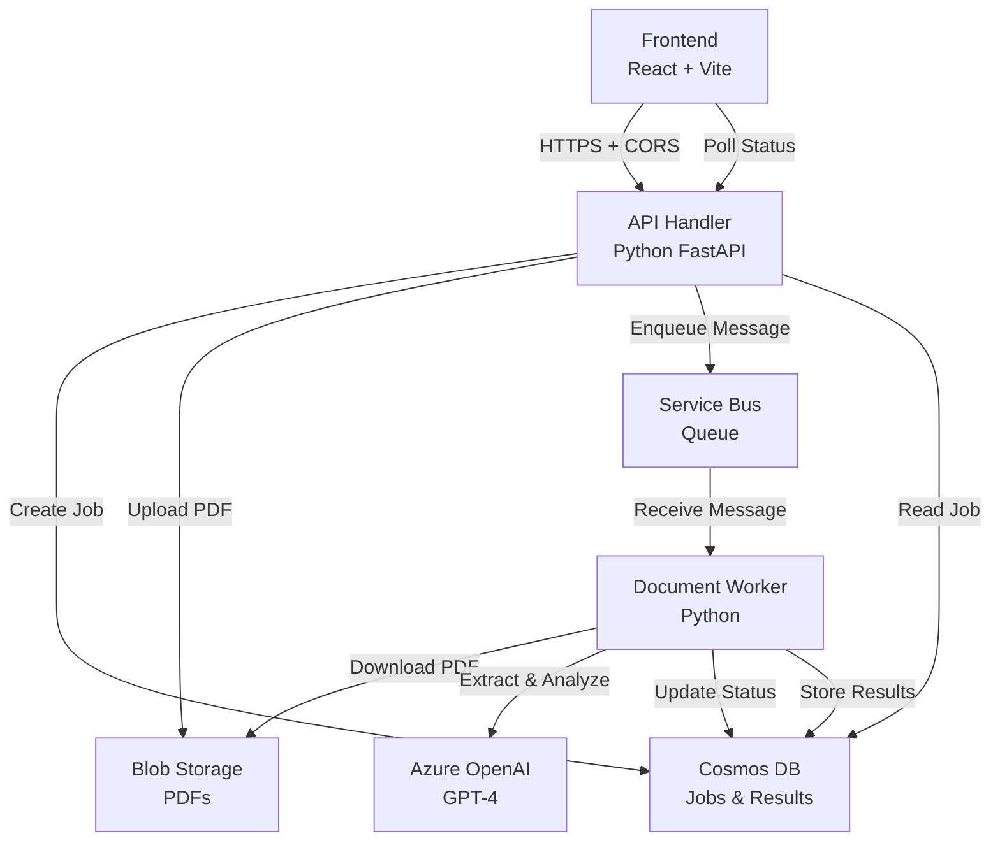
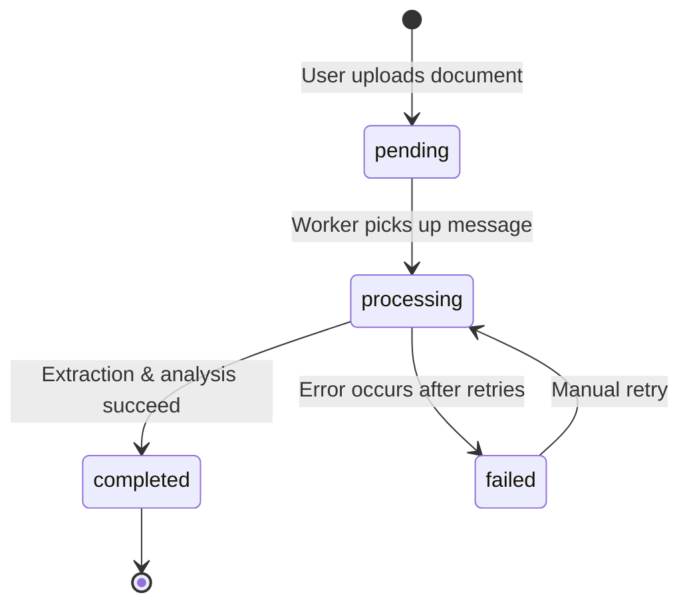

# Design Document

## Overview

This design addresses the incomplete Azure deployment of the GenAI Underwriting Workbench by implementing the missing document processing worker and fixing CORS configuration. The system currently has a working frontend with Cognito authentication and an API handler, but jobs get stuck because there's no worker listening to the Service Bus queue to process documents.

The solution involves:
1. Creating a Python-based worker that listens to Azure Service Bus
2. Implementing PDF processing with Azure OpenAI integration
3. Fixing CORS headers in the API handler
4. Deploying both components to AKS with proper configuration
5. Ensuring end-to-end job processing from upload to analysis

## Architecture

### Current State (Incomplete)
```
Frontend (React + Cognito Auth)
    ↓ HTTPS
API Handler (AKS Pod)
    ↓ Creates job in Cosmos DB
    ↓ Uploads PDF to Blob Storage
    ↓ Enqueues message to Service Bus
    ❌ NO WORKER LISTENING
    ❌ Jobs stuck in "pending" status
```

### Target State (Complete)
```
Frontend (React + Cognito Auth)
    ↓ HTTPS (with CORS)
API Handler (AKS Pod)
    ↓ Creates job in Cosmos DB
    ↓ Uploads PDF to Blob Storage
    ↓ Enqueues message to Service Bus
    ↓
Worker (AKS Pod) ← Listens to Service Bus
    ↓ Downloads PDF from Blob Storage
    ↓ Converts PDF pages to images
    ↓ Extracts text and data via Azure OpenAI
    ↓ Stores results in Cosmos DB
    ↓ Updates job status: pending → processing → completed
```

### Component Diagram


## Components and Interfaces

### 1. API Handler (Existing - Needs CORS Fix)

**File**: `api-server.py` (new FastAPI implementation)

**Responsibilities**:
- Handle document upload requests
- Generate SAS tokens for Blob Storage
- Create jobs in Cosmos DB
- Enqueue processing messages to Service Bus
- Serve job status and results
- **NEW**: Add proper CORS headers

**Endpoints**:
```python
POST /api/documents/upload
  Request: { filename: str, insuranceType: str }
  Response: { uploadUrl: str, jobId: str }
  
GET /api/jobs
  Response: [{ jobId: str, filename: str, status: str, ... }]
  
GET /api/jobs/{jobId}
  Response: { jobId: str, status: str, extractedData: [...], analysis: {...} }
  
GET /api/jobs/{jobId}/analysis
  Response: { summary: str, risks: [...], recommendations: [...] }
  
POST /api/jobs/{jobId}/chat
  Request: { message: str }
  Response: { response: str, context: [...] }
```

**CORS Configuration**:
```python
from fastapi.middleware.cors import CORSMiddleware

app.add_middleware(
    CORSMiddleware,
    allow_origins=["https://uw.sagesure.io"],
    allow_credentials=True,
    allow_methods=["GET", "POST", "PUT", "DELETE", "OPTIONS"],
    allow_headers=["*"],
)
```

### 2. Document Worker (NEW - Core Missing Component)

**File**: `worker.py`

**Responsibilities**:
- Listen to Service Bus queue for new job messages
- Download PDFs from Blob Storage
- Convert PDF pages to images
- Extract text and structured data using Azure OpenAI
- Perform underwriting analysis
- Update job status throughout processing
- Handle errors and retries

**Message Flow**:
```python
# Message format from Service Bus
{
  "jobId": "job-abc123",
  "filename": "application.pdf",
  "blobPath": "documents/job-abc123/application.pdf"
}
```

**Processing Steps**:
1. Receive message from Service Bus
2. Update job status to "processing"
3. Download PDF from Blob Storage
4. Convert each page to image (PNG/JPEG)
5. For each page:
   - Extract text using Azure OpenAI Vision
   - Classify page type (application, medical, financial)
   - Extract key-value pairs
6. Perform comprehensive analysis
7. Store results in Cosmos DB
8. Update job status to "completed"
9. Complete Service Bus message

**Error Handling**:
- Retry failed operations up to 3 times with exponential backoff
- On permanent failure, update job status to "failed" with error details
- Move message to dead-letter queue after max retries

### 3. Cosmos DB Schema

**Database**: `underwriting`

**Container**: `jobs` (partition key: `/jobId`)

**Job Document Structure**:
```json
{
  "id": "job-abc123",
  "jobId": "job-abc123",
  "filename": "application.pdf",
  "insuranceType": "life",
  "status": "pending|processing|completed|failed",
  "createdAt": "2024-12-05T20:00:00Z",
  "updatedAt": "2024-12-05T20:05:00Z",
  "progress": {
    "currentPage": 3,
    "totalPages": 10,
    "message": "Extracting page 3 of 10"
  },
  "extractedData": [
    {
      "page": 1,
      "pageType": "application_form",
      "text": "...",
      "keyValues": {
        "applicant_name": "John Doe",
        "date_of_birth": "1980-01-15",
        "coverage_amount": "$500,000"
      }
    }
  ],
  "analysis": {
    "summary": "...",
    "risks": [
      {
        "category": "medical",
        "severity": "medium",
        "description": "History of hypertension",
        "page": 3
      }
    ],
    "recommendations": ["Request additional medical records"],
    "completedAt": "2024-12-05T20:05:00Z"
  },
  "error": {
    "message": "Failed to process page 5",
    "details": "...",
    "timestamp": "2024-12-05T20:03:00Z"
  }
}
```

### 4. Service Bus Queue

**Queue Name**: `document-extraction`

**Message Properties**:
- TTL: 1 hour
- Max delivery count: 3
- Dead-letter queue: enabled
- Lock duration: 5 minutes

**Message Format**:
```json
{
  "jobId": "job-abc123",
  "filename": "application.pdf",
  "blobPath": "documents/job-abc123/application.pdf",
  "insuranceType": "life",
  "timestamp": "2024-12-05T20:00:00Z"
}
```

### 5. Blob Storage

**Container**: `documents`

**Structure**:
```
documents/
  job-abc123/
    application.pdf          # Original uploaded PDF
    pages/
      page-001.png          # Converted page images
      page-002.png
      ...
```

**Access**:
- API Handler: Generates SAS tokens for upload
- Worker: Uses managed identity or connection string for download

## Data Models

### Job Status State Machine



### Extracted Data Model

```python
from typing import List, Dict, Optional
from pydantic import BaseModel
from datetime import datetime

class KeyValue(BaseModel):
    key: str
    value: str
    confidence: float
    page: int

class PageData(BaseModel):
    page: int
    pageType: str  # application_form, medical_report, financial_statement
    text: str
    keyValues: Dict[str, str]
    confidence: float

class Risk(BaseModel):
    category: str  # medical, financial, lifestyle
    severity: str  # low, medium, high, critical
    description: str
    page: int
    evidence: str

class Analysis(BaseModel):
    summary: str
    risks: List[Risk]
    recommendations: List[str]
    completedAt: datetime

class Job(BaseModel):
    id: str
    jobId: str
    filename: str
    insuranceType: str
    status: str
    createdAt: datetime
    updatedAt: datetime
    progress: Optional[Dict[str, any]]
    extractedData: Optional[List[PageData]]
    analysis: Optional[Analysis]
    error: Optional[Dict[str, str]]
```

## Correctness Properties

*A property is a characteristic or behavior that should hold true across all valid executions of a system-essentially, a formal statement about what the system should do. Properties serve as the bridge between human-readable specifications and machine-verifiable correctness guarantees.*

### Property 1: Job creation and enqueuing

*For any* valid document upload request, creating a job in Cosmos DB and enqueuing a message to Service Bus should both succeed or both fail (atomicity).
**Validates: Requirements 1.1**

### Property 2: Worker message processing

*For any* message received from Service Bus, the worker should update the job status to "processing" before beginning PDF extraction.
**Validates: Requirements 1.2, 1.3**

### Property 3: Status progression

*For any* job, the status should progress monotonically through valid states: pending → processing → (completed | failed), never skipping states or moving backwards.
**Validates: Requirements 1.3, 1.4**

### Property 4: Status persistence

*For any* job status change, the new status should be persisted to Cosmos DB before the worker completes the Service Bus message.
**Validates: Requirements 3.1**

### Property 5: API response time

*For any* job status query, the API should return the current status from Cosmos DB within 1 second under normal load.
**Validates: Requirements 3.2**

### Property 6: Progress updates

*For any* job in "processing" status, the progress field should be updated at least once per page processed.
**Validates: Requirements 3.3**

### Property 7: CORS header presence

*For any* API response to a request from https://uw.sagesure.io, the response should include Access-Control-Allow-Origin header with the correct value.
**Validates: Requirements 4.1, 4.2**

### Property 8: CORS methods

*For any* OPTIONS preflight request, the API should respond with Access-Control-Allow-Methods including GET, POST, PUT, DELETE, OPTIONS.
**Validates: Requirements 4.3**

### Property 9: PDF download success

*For any* valid job message, the worker should successfully download the PDF from Blob Storage using the provided blob path.
**Validates: Requirements 5.1**

### Property 10: Page processing completeness

*For any* PDF with N pages, the extractedData array should contain exactly N PageData objects after successful processing.
**Validates: Requirements 5.5**

### Property 11: Analysis trigger

*For any* job where extraction completes successfully, the system should automatically trigger analysis using Azure OpenAI.
**Validates: Requirements 6.1**

### Property 12: Analysis structure

*For any* completed analysis, the result should contain all required fields: summary, risks array, and recommendations array.
**Validates: Requirements 6.3**

### Property 13: Error logging

*For any* error that occurs during processing, the system should log the error with context including jobId, processing step, and timestamp.
**Validates: Requirements 7.1**

### Property 14: Retry behavior

*For any* transient error, the worker should retry the operation up to 3 times with exponential backoff before marking the job as failed.
**Validates: Requirements 7.2**

### Property 15: Dead-letter queue

*For any* message that exceeds max delivery count, Service Bus should automatically move it to the dead-letter queue.
**Validates: Requirements 7.3**

### Property 16: Error status update

*For any* job that fails after all retries, the job status should be updated to "failed" with specific error details in the error field.
**Validates: Requirements 7.4**

### Property 17: Deployment idempotency

*For any* deployment script execution, running it multiple times should produce the same end state without errors.
**Validates: Requirements 8.1**

### Property 18: Rolling update

*For any* deployment update, the system should perform a rolling update ensuring at least one pod remains available throughout.
**Validates: Requirements 8.2**

### Property 19: Health check validation

*For any* deployment completion, all pods should pass health checks before the deployment is marked as successful.
**Validates: Requirements 8.3**

## Error Handling

### API Handler Errors

| Error Scenario | HTTP Status | Response | Action |
|----------------|-------------|----------|--------|
| Missing filename | 400 | `{"error": "filename is required"}` | Return immediately |
| Cosmos DB unavailable | 500 | `{"error": "Database unavailable"}` | Retry 3 times, then fail |
| Blob Storage unavailable | 500 | `{"error": "Storage unavailable"}` | Retry 3 times, then fail |
| Service Bus unavailable | 500 | `{"error": "Queue unavailable"}` | Retry 3 times, then fail |
| Job not found | 404 | `{"error": "Job not found"}` | Return immediately |
| CORS validation failed | 403 | `{"error": "Origin not allowed"}` | Return immediately |

### Worker Errors

| Error Scenario | Retry | Action |
|----------------|-------|--------|
| Service Bus connection lost | Yes (3x) | Reconnect with exponential backoff |
| PDF download failed | Yes (3x) | Retry download, then fail job |
| PDF corrupted/invalid | No | Mark job as failed immediately |
| Azure OpenAI rate limit | Yes (3x) | Wait and retry with backoff |
| Azure OpenAI timeout | Yes (3x) | Retry with longer timeout |
| Cosmos DB write failed | Yes (3x) | Retry write, then fail job |
| Out of memory | No | Mark job as failed, log for ops |

### Retry Strategy

```python
def exponential_backoff(attempt: int, base_delay: float = 0.5, factor: float = 2.0) -> float:
    """Calculate delay for exponential backoff"""
    return base_delay * (factor ** (attempt - 1))

def with_retries(fn, max_retries: int = 3):
    """Execute function with exponential backoff retries"""
    for attempt in range(1, max_retries + 1):
        try:
            return fn()
        except Exception as e:
            if attempt == max_retries:
                raise
            delay = exponential_backoff(attempt)
            logging.warning(f"Attempt {attempt} failed, retrying in {delay}s: {e}")
            time.sleep(delay)
```

## Testing Strategy

### Unit Testing

We will use **pytest** for unit testing Python components.

**API Handler Tests**:
- Test CORS headers are present for allowed origins
- Test CORS headers are absent for disallowed origins
- Test job creation with valid input
- Test job creation with missing filename returns 400
- Test SAS token generation for Blob Storage
- Test Service Bus message enqueuing
- Test job status retrieval
- Test job not found returns 404

**Worker Tests**:
- Test Service Bus message parsing
- Test job status update to "processing"
- Test PDF download from Blob Storage
- Test PDF page conversion to images
- Test Azure OpenAI extraction call
- Test analysis result storage
- Test error handling and retry logic
- Test dead-letter queue behavior

**Test Example**:
```python
def test_cors_headers_for_allowed_origin():
    """Test that CORS headers are present for allowed origin"""
    response = client.get("/api/jobs", headers={"Origin": "https://uw.sagesure.io"})
    assert response.status_code == 200
    assert response.headers["Access-Control-Allow-Origin"] == "https://uw.sagesure.io"

def test_job_creation_with_missing_filename():
    """Test that missing filename returns 400"""
    response = client.post("/api/documents/upload", json={"insuranceType": "life"})
    assert response.status_code == 400
    assert "filename" in response.json()["error"]
```

### Property-Based Testing

We will use **Hypothesis** for property-based testing.

**Configuration**: Each property test will run a minimum of 100 iterations.

**Property Test 1: Job status progression**
```python
from hypothesis import given, strategies as st

@given(st.lists(st.sampled_from(["pending", "processing", "completed", "failed"]), min_size=2))
def test_status_progression_is_valid(status_sequence):
    """
    Feature: azure-job-processing-fix, Property 3: Status progression
    
    For any sequence of status updates, verify that the progression follows
    valid state transitions: pending → processing → (completed | failed)
    """
    valid_transitions = {
        "pending": ["processing"],
        "processing": ["completed", "failed"],
        "completed": [],
        "failed": ["processing"]  # Allow manual retry
    }
    
    for i in range(len(status_sequence) - 1):
        current = status_sequence[i]
        next_status = status_sequence[i + 1]
        assert next_status in valid_transitions[current], \
            f"Invalid transition: {current} → {next_status}"
```

**Property Test 2: Page processing completeness**
```python
@given(st.integers(min_value=1, max_value=100))
def test_extracted_data_matches_page_count(num_pages):
    """
    Feature: azure-job-processing-fix, Property 10: Page processing completeness
    
    For any PDF with N pages, the extractedData array should contain exactly N entries
    """
    # Create mock PDF with num_pages pages
    mock_pdf = create_mock_pdf(num_pages)
    
    # Process PDF
    extracted_data = process_pdf(mock_pdf)
    
    # Verify completeness
    assert len(extracted_data) == num_pages
    assert all(page_data.page in range(1, num_pages + 1) for page_data in extracted_data)
```

**Property Test 3: CORS header presence**
```python
@given(st.sampled_from(["/api/jobs", "/api/documents/upload", "/api/jobs/test-123"]))
def test_cors_headers_present_for_all_endpoints(endpoint):
    """
    Feature: azure-job-processing-fix, Property 7: CORS header presence
    
    For any API endpoint, responses to requests from allowed origin should include CORS headers
    """
    response = client.get(endpoint, headers={"Origin": "https://uw.sagesure.io"})
    assert "Access-Control-Allow-Origin" in response.headers
    assert response.headers["Access-Control-Allow-Origin"] == "https://uw.sagesure.io"
```

**Property Test 4: Retry exponential backoff**
```python
@given(st.integers(min_value=1, max_value=10))
def test_exponential_backoff_increases(attempt):
    """
    Feature: azure-job-processing-fix, Property 14: Retry behavior
    
    For any retry attempt N, the backoff delay should be greater than attempt N-1
    """
    delay_current = exponential_backoff(attempt)
    if attempt > 1:
        delay_previous = exponential_backoff(attempt - 1)
        assert delay_current > delay_previous
```

**Property Test 5: Error logging completeness**
```python
@given(st.text(min_size=1), st.text(min_size=1), st.datetimes())
def test_error_logs_contain_required_fields(job_id, error_message, timestamp):
    """
    Feature: azure-job-processing-fix, Property 13: Error logging
    
    For any error, the log entry should contain jobId, error message, and timestamp
    """
    log_entry = log_error(job_id, error_message, timestamp)
    
    assert "jobId" in log_entry
    assert "error" in log_entry
    assert "timestamp" in log_entry
    assert log_entry["jobId"] == job_id
```

### Integration Testing

**End-to-End Test**:
1. Upload a test PDF via API
2. Verify job created in Cosmos DB with status "pending"
3. Verify message enqueued to Service Bus
4. Wait for worker to process (poll job status)
5. Verify job status changes to "processing"
6. Verify job status changes to "completed"
7. Verify extractedData is populated
8. Verify analysis is populated
9. Query job via API and verify all data is present

**CORS Integration Test**:
1. Make API request from https://uw.sagesure.io origin
2. Verify CORS headers are present
3. Make OPTIONS preflight request
4. Verify preflight response includes correct methods
5. Make actual request after preflight
6. Verify request succeeds

**Error Recovery Test**:
1. Upload PDF that will cause processing error
2. Verify job status changes to "failed"
3. Verify error details are populated
4. Verify message moved to dead-letter queue after retries

### Load Testing

**Scenario**: 100 concurrent document uploads
- Verify all jobs are created successfully
- Verify all jobs are processed within 5 minutes
- Verify no jobs get stuck in "pending" status
- Verify worker scales up via KEDA
- Verify API response times remain under 1 second

## Deployment

### Prerequisites

- Azure CLI authenticated
- kubectl configured for AKS cluster
- Docker images built and pushed to ACR:
  - `{acr-name}.azurecr.io/uw/api:latest`
  - `{acr-name}.azurecr.io/uw/worker:latest`

### Deployment Steps

1. **Update ConfigMap** with actual Azure resource names
2. **Create Secrets** with sensitive credentials
3. **Apply Kubernetes manifests**:
   ```bash
   kubectl apply -f k8s/manifests.yaml
   ```
4. **Verify deployments**:
   ```bash
   kubectl get pods -n underwriting
   kubectl logs -n underwriting -l app=api-handler
   kubectl logs -n underwriting -l app=document-extract
   ```
5. **Test API endpoint**:
   ```bash
   curl -H "Origin: https://uw.sagesure.io" https://api.uw.sagesure.io/api/jobs
   ```

### Configuration

**Environment Variables** (ConfigMap):
- `COSMOS_DB_ENDPOINT`
- `COSMOS_DB_NAME`
- `STORAGE_ACCOUNT_NAME`
- `SERVICE_BUS_NAMESPACE`
- `SERVICE_BUS_QUEUE_NAME`
- `AZURE_OPENAI_ENDPOINT`
- `AZURE_OPENAI_DEPLOYMENT`

**Secrets**:
- `COSMOS_DB_KEY`
- `AZURE_OPENAI_KEY`
- `SERVICE_BUS_CONNECTION_STRING`

### Monitoring

**Key Metrics**:
- Job processing time (p50, p95, p99)
- Worker queue depth
- API response time
- Error rate by component
- Pod CPU/memory usage

**Alerts**:
- Jobs stuck in "pending" for > 5 minutes
- Worker pod crashes
- API error rate > 5%
- Service Bus dead-letter queue depth > 10

## Security Considerations

1. **Workload Identity**: Use Azure AD workload identity for pod authentication
2. **Secrets Management**: Store sensitive data in Kubernetes secrets, not ConfigMaps
3. **Network Policies**: Restrict pod-to-pod communication
4. **CORS**: Only allow https://uw.sagesure.io origin
5. **SAS Tokens**: Generate short-lived SAS tokens (1 hour) for blob access
6. **TLS**: Use HTTPS for all external communication
7. **RBAC**: Limit service account permissions to minimum required

## Performance Optimization

1. **Batch Processing**: Process multiple pages in parallel where possible
2. **Connection Pooling**: Reuse Azure SDK clients across requests
3. **Caching**: Cache frequently accessed job data
4. **Autoscaling**: Use KEDA to scale workers based on queue depth
5. **Resource Limits**: Set appropriate CPU/memory limits to prevent resource exhaustion
